# netology-terraform-dz5
"Использование Terraform в команде"

Задание 1

По заданию первому, обнаружена ошибка во внешнем модуле, добавлентег версии.

Ошибка обнаружена после запуска tflint

Так же обнаружена ошибка "не обнаружена версия провайдера" data "template_file" "cloudinit", и еще одна ошибка что определены заявлены переменные, но они не используются - и были закомментированы для дальнейшего удаления.

Найдена ошибка отсутствия тега.

При проверке checkov  хочет уже использовать не тег а хеш коммита. Добавил комментарий (https://stackoverflow.com/questions/79326416/how-to-do-a-point-in-time-recovery-with-rds-terraform-using-conditionals)   вида #checkov:skip=CKV_TF_1: Ensure Terraform module sources use a commit hash

Chechov запуск
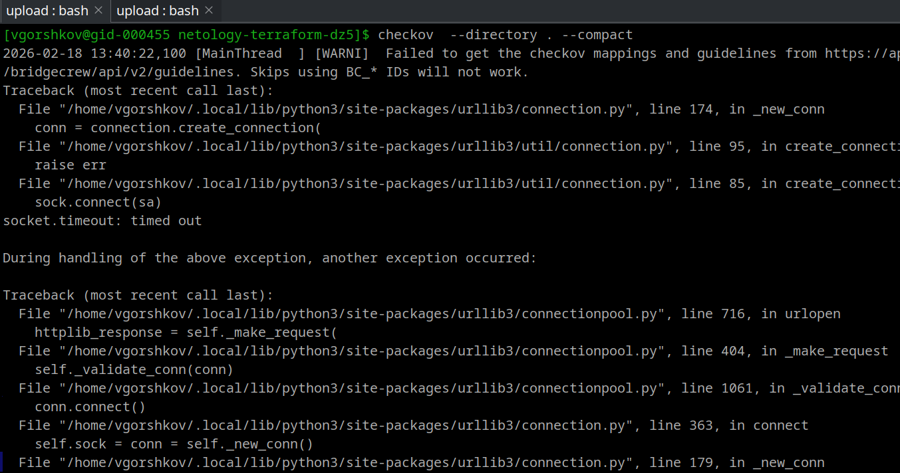

Tflint запуск
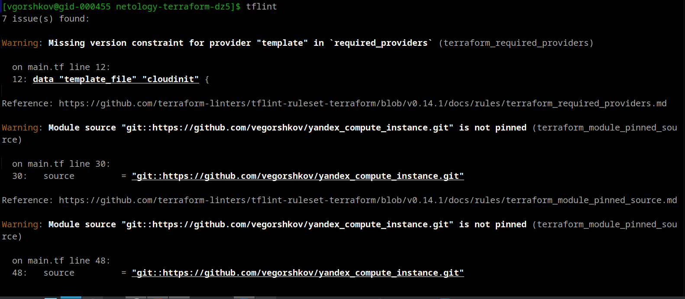

Задание 2
Создание S3 бакета
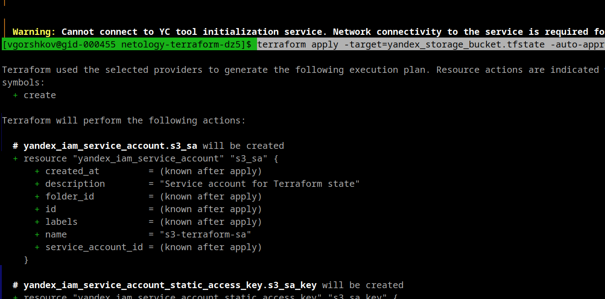
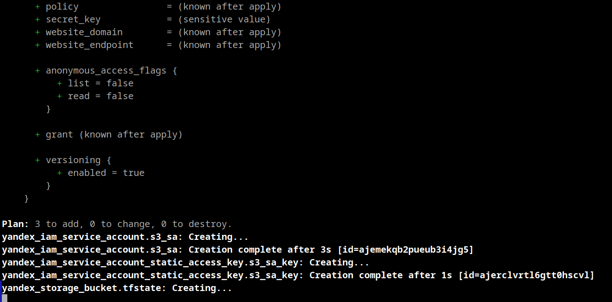

  добавление роли storage editor для сервисного аккаунта
  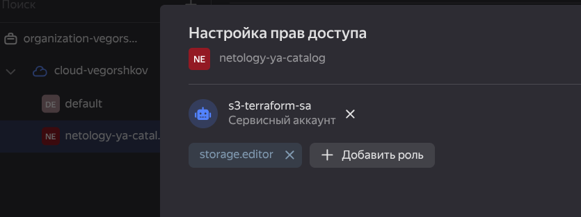

Создание bucket 
  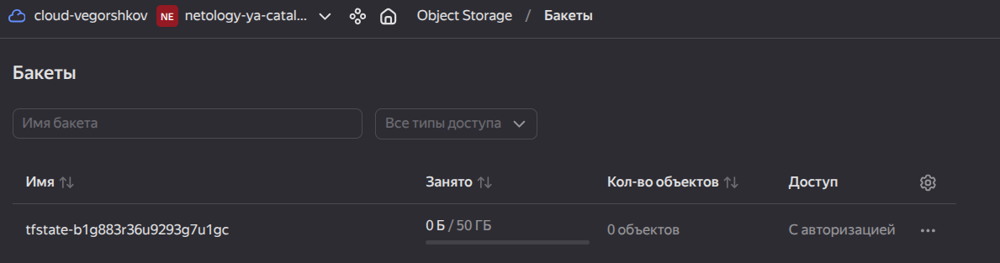

инициализация переноса tfstate

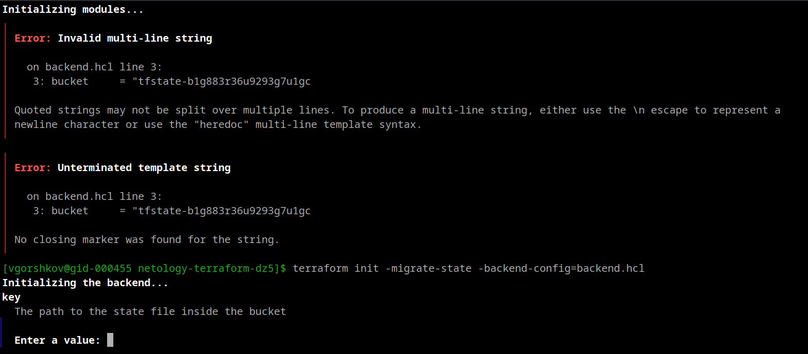

Миграция
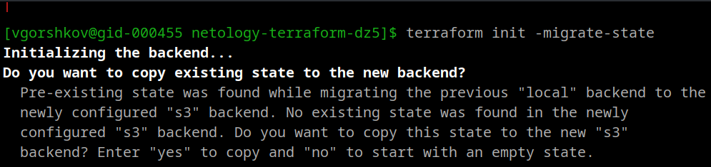
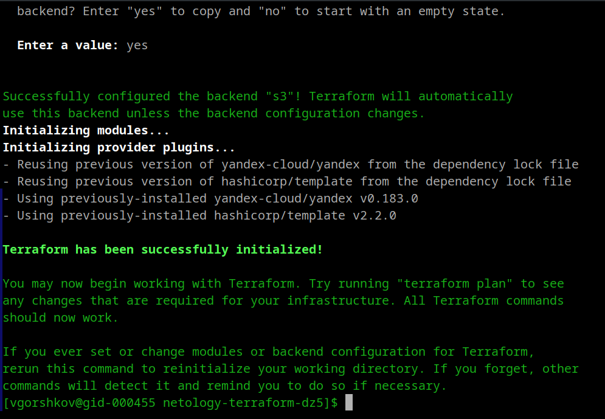

Результат
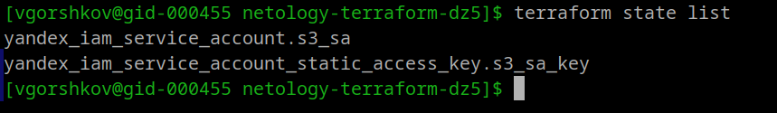

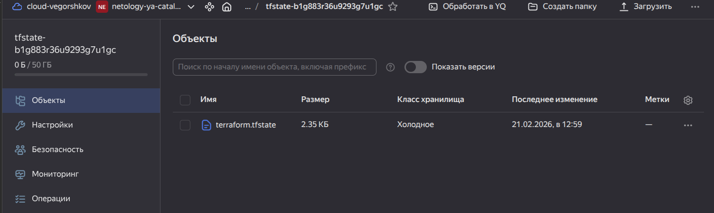

Выполняем terraform validate   и   terraform plan
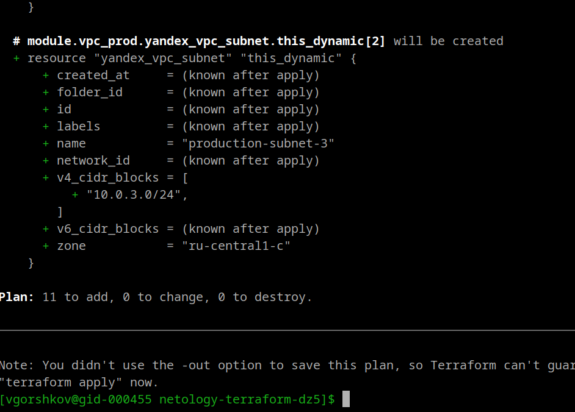

Открываю  terraform console
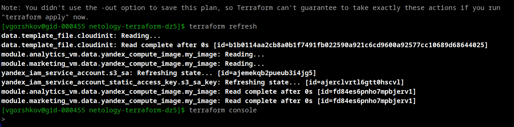

Запуск:
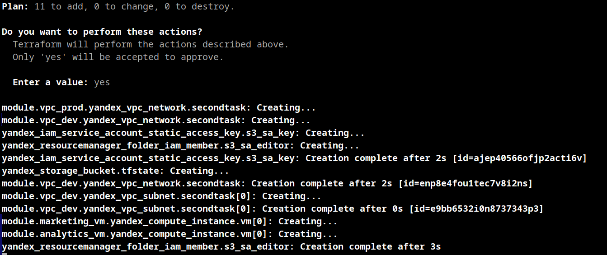

Исправляю ошибки:
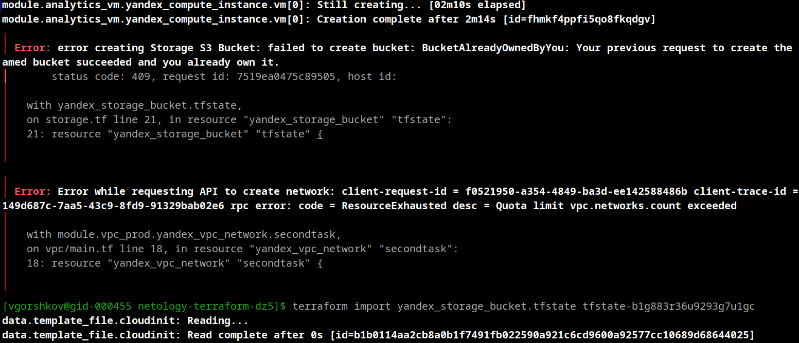

init
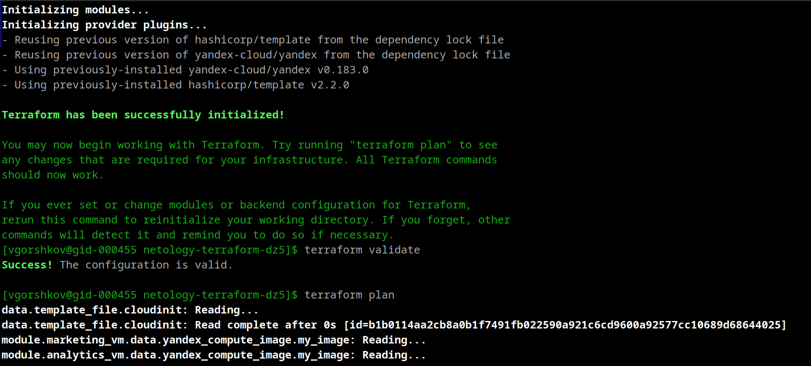

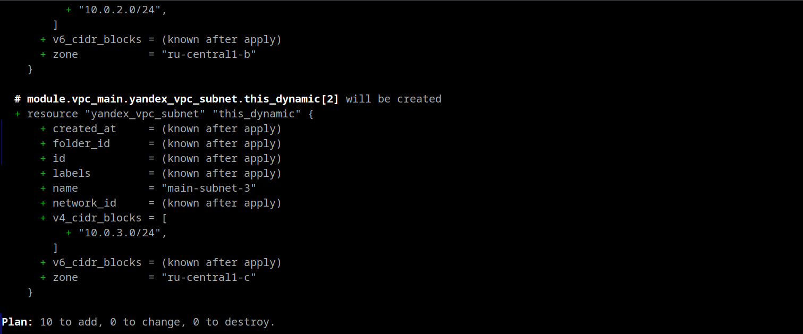

apply

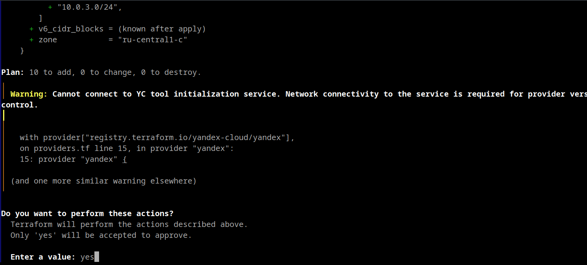

error

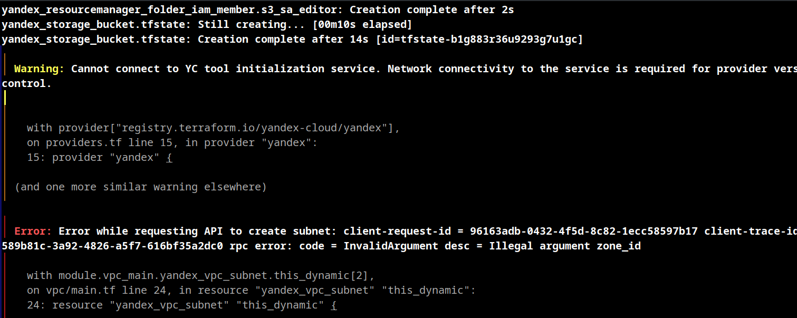

Ура создано.
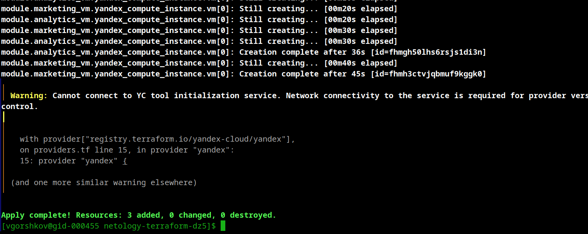

Созданы:

VPC сеть

3 subnet

2 VM

S3 bucket

service account

static access key

Фиксируем результат:
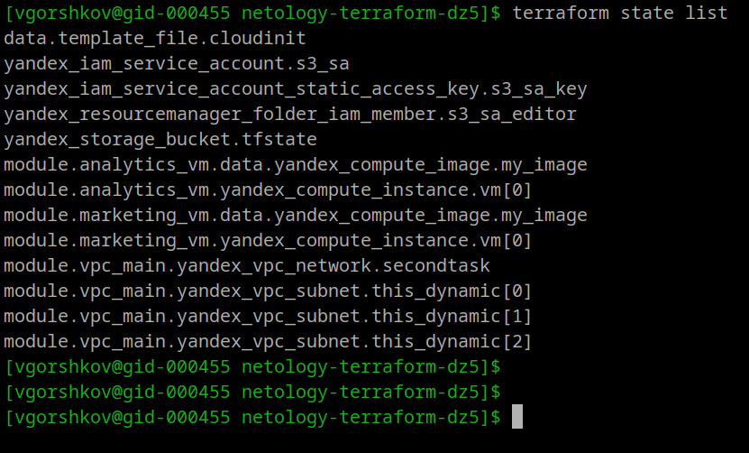

